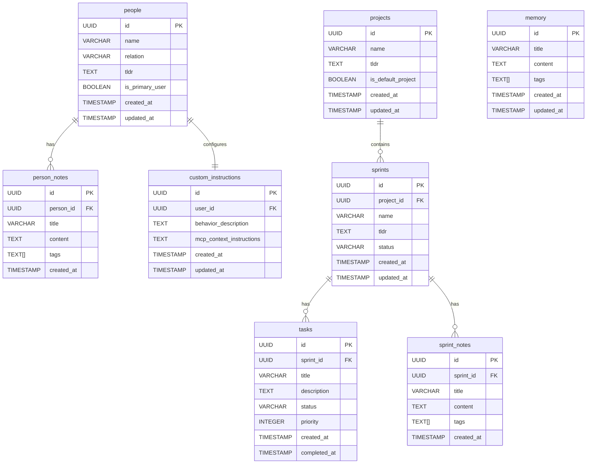

```plantuml
@startuml
!theme plain

skinparam defaultFontName "Inter, Helvetica, Arial, sans-serif"
skinparam shadowing false
skinparam package {
    borderColor #333
    backgroundColor #FFF
}
skinparam rectangle {
    borderColor #666
    backgroundColor #FAFAFA
}
skinparam note {
    backgroundColor #FFFFF0
    borderColor #888
}

title <b>Neural System - Estrutura Lógica</b>

package "OVERVIEW" {
    rectangle "O que dá para fazer" as R_Overview_Actions
    note right of R_Overview_Actions
        - Navegar para seções
        - Ver stats
        - Visualizar config da IA
    end note

    rectangle "Pessoas" as R_Overview_People
    note right of R_Overview_People
        Nome, Relação, Nº Total
    end note

    rectangle "Projetos" as R_Overview_Projects
    note right of R_Overview_Projects
        Nome, Nº Sprints, Nº Tasks Totais
    end note
    
    rectangle "Custom Instructions" as R_Overview_Custom
    note right of R_Overview_Custom
        <b>User Principal:</b> Nome + TL;DR
        <b>Comportamento IA:</b> Instrução de persona
        <b>Context:</b> Instrução de uso do sistema MCP
    end note

    rectangle "Memórias" as R_Overview_Memory
    note right of R_Overview_Memory
        Nome da Memória, Tag, Data
    end note
}

package "PEOPLE" {
    package "Tela: Lista de Pessoas" {
        rectangle "O que aparece" as R_PeopleList_Body
        note right of R_PeopleList_Body
            - Nome, Relação, TL;DR, Nº de notas
            - Marco como user principal (não deletável)
        end note
        
        rectangle "O que dá para fazer" as R_PeopleList_Actions
        note right of R_PeopleList_Actions
            - Criar/Deletar pessoa
            - Clicar para ver detalhes
        end note
    }
    
    R_PeopleList_Body -[hidden]down-> R_PeopleList_Actions
    
    package "Tela: Detalhe da Pessoa" {
        rectangle "O que aparece" as R_PersonDetail_Body
        note right of R_PersonDetail_Body
            - Relação, TL;DR
            - Notas completas da pessoa
        end note
        
        rectangle "O que dá para fazer" as R_PersonDetail_Actions
        note right of R_PersonDetail_Actions
            - Editar infos
            - Deletar pessoa
            - Adicionar/Editar/Deletar notas
        end note
    }
    
    R_PersonDetail_Body -[hidden]down-> R_PersonDetail_Actions
    
    R_PeopleList_Actions ..> R_PersonDetail_Body : "Clica em uma pessoa"
}

package "PROJECTS" {
    package "Tela: Lista de Projetos" {
        rectangle "O que aparece" as R_ProjectList_Body
        note right of R_ProjectList_Body
            - Nome do projeto, TL;DR, nº de sprints/tasks
            - Sprints com nº de tasks
            - Knowledge como projeto padrão
        end note
        
        rectangle "O que dá para fazer" as R_ProjectList_Actions
        note right of R_ProjectList_Actions
            - Criar/Deletar projeto
            - Criar sprint
            - Clicar para ver detalhes
        end note
    }
    
    R_ProjectList_Body -[hidden]down- R_ProjectList_Actions

    package "Tela: Detalhe do Projeto" {
        rectangle "O que aparece" as R_ProjectDetail_Body
        note right of R_ProjectDetail_Body
            - Nome/TL;DR do projeto
            - Lista de sprints (nome, tl;dr, nº tasks/notas)
        end note
        
        rectangle "O que dá para fazer" as R_ProjectDetail_Actions
        note right of R_ProjectDetail_Actions
            - Editar/Deletar projeto
            - Criar/Deletar sprint
            - Clicar para ver detalhes
        end note
    }
    
    R_ProjectDetail_Body -[hidden]down- R_ProjectDetail_Actions
    
    package "Tela: Detalhe do Sprint" {
        rectangle "O que aparece" as R_SprintDetail_Body
        note right of R_SprintDetail_Body
            - Nome/TL;DR do sprint
            - Todas as tasks (título, status, desc)
            - Todas as notas do sprint
        end note
        
        rectangle "O que dá para fazer" as R_SprintDetail_Actions
        note right of R_SprintDetail_Actions
            - Editar sprint
            - CRUD de tasks, CRUD de notas
            - Filtrar tasks por status
        end note
    }
    
    R_SprintDetail_Body -[hidden]down- R_SprintDetail_Actions
    
    R_ProjectList_Actions ..> R_ProjectDetail_Body : "Clica em um projeto"
    R_ProjectDetail_Actions ..> R_SprintDetail_Body : "Clica em um sprint"
}

package "CUSTOM INSTRUCTIONS" {
    package "Tela de Gerenciamento" {
        rectangle "O que aparece" as R_CI_Body
        note right of R_CI_Body
            - <b>User principal:</b> Link para a pessoa
            - <b>Comportamento da IA:</b> Descrição editável
            - <b>Lista de memórias:</b> Título e tags de todas
            - <b>Instruções MCP:</b> Como a IA deve usar o sistema
        end note
        
        rectangle "O que dá para fazer" as R_CI_Actions
        note right of R_CI_Actions
            - Editar comportamento da IA
            - Criar/editar/deletar memórias
            - Organizar memórias por tags
            - Editar instruções de uso do MCP
            - Gerenciar sistema de memória unificado
        end note
    }
    R_CI_Body -[hidden]down- R_CI_Actions
}

@enduml
```

# 🧠 Marco Neural System - Arquitetura Detalhada & Problemas Reais

## 🎯 **O QUE ESTOU TENTANDO FAZER**

Estou criando um **Neural System** (sistema de conhecimento pessoal) que deve funcionar com:
- ✅ **Frontend web** (Next.js) para eu gerenciar dados
- ✅ **Claude.ai via MCP** para IA consultar/modificar dados

**OBJETIVO**: Que Claude.ai consiga ler/escrever no meu banco Supabase através de MCP, enquanto eu também consigo usar interface web normal.

**RESULTADO ESPERADO**:
```
Marco usa Frontend ────► Supabase ◄──── Claude.ai usa MCP
                           ▲
                    (mesmo database)
```
Ambos acessam mesmos dados, protocolos diferentes, sem conflito.

## 🏠 **CONTEXTO DO PROJETO**

O **Cognitive Overflow** é um hub experimental modular (Next.js) que abriga múltiplos projetos:
- Marco's Personality Trip, Matrix Project, TokenFlow, Comic Builder
- **Neural System** é UM dos projetos (o mais complexo arquiteturalmente)
- URL: `https://cognitiveoverflow.vercel.app/neural`

## 📁 **ARQUIVOS PRINCIPAIS**

### Frontend
- `app/neural/page.tsx` - Dashboard principal
- `app/neural/layout.tsx` - Matrix Auth wrapper
- `components/neural/*` - Componentes React (OverviewTab, PeopleTab, ProjectsTab, CustomInstructionsTab)
- `lib/supabase.ts` - Client Supabase

### Backend MCP
- `app/api/mcp-server/route.ts` - MCP endpoint principal (ÚNICO)
- `app/.well-known/mcp/route.ts` - Discovery

### Environment
```bash
# .env.local
NEXT_PUBLIC_SUPABASE_URL=https://dtijantzpqtevdqypaeg.supabase.co
NEXT_PUBLIC_SUPABASE_ANON_KEY=eyJhbGciOiJIUzI1NiIsInR5cCI6IkpXVCJ9...
MCP_SECRET_KEY=neural_matrix_jwt_secret_trinity_delineador_2024_hardcore
MCP_MASTER_PASSWORD=neural_access_2024
```

---

## 🎯 **RESUMO DO SISTEMA EM 4 PONTOS**

1. **📊 Overview** que traz infos de pessoas (quantidade, nome, relação) e projetos (quantidade, nome, quantos sprints tem), status que conta quantas pessoas, projetos, sprints e tasks tem, custom instructions (usuário principal + comportamento IA + memória) e context de uso do sistema.

2. **👥 Pessoas** que tem relação, tl;dr e notas. Marco é marcado como usuário principal (não pode ser deletado).

3. **📁 Projetos** que tem sprints, tasks e notas. Knowledge é projeto padrão (não pode ser deletado).

4. **🎭 Custom Instructions** que tem usuário principal (Marco), comportamento da IA, memória RAM/ROM unificada e instruções de uso do MCP.

---

## 🗄️ **BANCO DE DADOS & ESTRUTURA**



**Memory System: Todas as memórias vivem na mesma tabela, sem distinção de tipo. A IA e o Frontend podem buscar por ID, por tags ou pegar uma listagem geral. Overview só carrega título + tags. CustomInstructions gerencia tudo. MCP acessa conforme a necessidade.**


---


---

## 🎛️ **FUNCIONALIDADES POR NÍVEL**

### 🏠 **OVERVIEW**
**O que aparece:**
- **Pessoas**: Nome das pessoas, relação, número total de pessoas
- **Projetos**: Nome dos projetos, quantos sprints, quantas tasks totais
- **Custom Instructions**: User principal (Marco), comportamento IA, contadores memória RAM/ROM
- **Context**: Instruções de uso do sistema MCP
- **Navegação**: Links para People/Projects/Custom Instructions

**O que dá para fazer:**
- Navegar para People, Projects ou Custom Instructions
- Ver estatísticas gerais
- Visualizar configuração da IA resumida

### 👥 **PEOPLE (Lista)**
**O que aparece:**
- Nome das pessoas, relação, tl;dr, quantas notas cada uma tem
- Marco marcado como usuário principal (não pode ser deletado)

**O que dá para fazer:**
- ✅ Criar pessoa (nome, relationship, tldr)
- ✅ Deletar pessoa (exceto Marco que é usuário principal)
- 🔍 Clicar numa pessoa para ver detalhes

### 👤 **PERSON (Individual)**
**O que aparece:**
- Relação, tl;dr, notas completas da pessoa

**O que dá para fazer:**
- ✅ Editar infos da pessoa (nome, relação, tldr)
- ✅ Deletar pessoa
- ✅ Adicionar notas
- ✅ Editar notas existentes
- ✅ Deletar notas

### 📁 **PROJECTS (Lista)**
**O que aparece:**
- Nome dos projetos, tl;dr, quantidade de sprints e tasks totais
- Nome dos sprints de cada projeto com quantidade de tasks
- Knowledge marcado como projeto padrão (não pode ser deletado)

**O que dá para fazer:**
- ✅ Criar novo projeto (nome, tl;dr)
- ✅ Criar novo sprint em projeto específico (padrão: Knowledge)
- ✅ Deletar projeto (exceto Knowledge que é padrão)
- 🔍 Clicar num projeto para ver detalhes

### 📊 **PROJECT (Individual)**
**O que aparece:**
- Nome do projeto, tl;dr do projeto
- Lista de sprints: nome, tl;dr, quantidade de tasks, quantidade de notas

**O que dá para fazer:**
- ✅ Editar nome do projeto e tl;dr
- ✅ Deletar projeto (exceto Knowledge que é padrão)
- ✅ Criar sprint (com tl;dr)
- ✅ Deletar sprint
- 🔍 Clicar num sprint para ver detalhes

### 🏃 **SPRINT (Individual)**
**O que aparece:**
- Nome do sprint, tl;dr
- Todas as tasks (título, status, descrição)
- Todas as notas do sprint

**O que dá para fazer:**
- ✅ Editar nome do sprint e tl;dr
- ✅ Criar tasks (título, descrição, prioridade)
- ✅ Editar tasks (inclusive status: todo → in_progress → completed)
- ✅ Deletar tasks
- ✅ Criar notas do sprint
- ✅ Editar notas
- ✅ Deletar notas
- 🔍 Filtrar tasks por status (todo, in_progress, completed)

### 🎭 **CUSTOM INSTRUCTIONS**
**O que aparece:**
- User principal: Marco (link para pessoa)
- Comportamento da IA: descrição editável de como a IA deve se comportar
- Lista de memórias: título e tags de todas as memórias disponíveis
- Instruções MCP: como IA deve usar o sistema

**O que dá para fazer:**
- ✅ Editar comportamento da IA
- ✅ Criar/editar/deletar memórias
- ✅ Organizar memórias por tags
- ✅ Editar instruções de uso do MCP
- ✅ Gerenciar sistema de memória unificado da IA

### Status Workflow das Tasks
```
📝 pending → 🔄 in_progress → ✅ completed
```
**Nota**: O campo `completed_at` é automaticamente preenchido quando task vai para "completed".

---

## 🔄 **PROTOCOLOS COMPARADOS**

### Frontend (HTTP/REST) vs MCP (JSON-RPC 2.0)

Atualmente o sistema usa 2 protocolos diferentes mas que executam **exatamente as mesmas queries** no Supabase:

**Frontend Request:**
```typescript
// Direct client-side call
const { data, error } = await supabase
  .from('people')
  .select('*')
  .eq('relation', 'família');

// React state update
setPeople(data);
```

**MCP Request:**
```json
{
  "jsonrpc": "2.0",
  "id": "req-1",
  "method": "tools/call",
  "params": {
    "name": "list_people", 
    "arguments": { "relation": "família" }
  }
}
```

**MCP Response:**
```json
{
  "jsonrpc": "2.0",
  "id": "req-1", 
  "result": {
    "content": [{
      "type": "text",
      "text": "Found 3 people:\n• Yasmin (esposa)\n• José (pai)\n• Rita (mãe)"
    }]
  }
}
```

**Key Difference**: 
- Frontend gets **raw data** for UI manipulation
- MCP gets **formatted text** for AI consumption

### Database Level (Same for Both)
```sql
-- Frontend e MCP executam IDENTICAMENTE:
INSERT INTO people (name, relation, tldr) 
VALUES ('John', 'friend', NULL)
RETURNING *;

-- Queries complexas também idênticas:
SELECT p.*, 
       COUNT(pn.id) as notes_count
FROM people p
LEFT JOIN person_notes pn ON p.id = pn.person_id  
WHERE p.relation = 'família'
GROUP BY p.id
ORDER BY p.created_at DESC;
```

---

## 🛠️ **FERRAMENTAS DISPONÍVEIS (18 TOTAL)**

### People Management (6 tools)
- `list_people(relation?, search?, limit?)` - Lista com filtros
- `get_person(id)` - Detalhes + notes count
- `create_person(name, relation, tldr?)` - Criar pessoa
- `update_person(id, name?, relation?, tldr?)` - Atualizar pessoa
- `delete_person(id)` - Deletar pessoa (exceto Marco)
- `add_person_note(person_id, title, content, tags?)` - Adicionar nota à pessoa

### Project Management (10 tools)  
- `list_projects(status?, limit?)` - Lista projetos
- `get_project(id)` - Projeto + sprints + tasks count
- `create_project(name, tldr?)` - Criar projeto
- `update_project(id, name?, tldr?)` - Atualizar projeto
- `delete_project(id)` - Deletar projeto (exceto Knowledge)
- `list_sprints(project_id, status?)` - Sprints do projeto
- `create_sprint(project_id, name, tldr?, status?)` - Criar sprint
- `get_sprint(id)` - Sprint + tasks + notes
- `update_sprint(id, name?, tldr?, status?)` - Atualizar sprint
- `delete_sprint(id)` - Deletar sprint + tasks

### Custom Instructions & Memory (4 tools)
- `get_custom_instructions()` - Configuração completa da IA + lista de memórias
- `list_memory()` - Retorna lista com título e tags de todas as memórias
- `get_memory(id)` - Retorna o conteúdo completo de uma memória específica
- `search_memory(tags)` - Retorna memórias que contenham todas as tags especificadas

### Task & Notes Management (complementares)
- Tasks: `list_tasks`, `create_task`, `get_task`, `update_task`, `delete_task`
- Notes: `create_sprint_note`, `update_sprint_note`, `delete_sprint_note`, `update_note`, `delete_note`

---

## 🚨 **PROBLEMAS ATUAIS ESPECÍFICOS**

### Claude.ai Integration
- ✅ **Conecta**: Mostra "Conectado" no Claude Desktop settings
- ❌ **Tools vazias**: "NENHUMA FERRAMENTA FORNECIDA" 
- 🤔 **Suspeita**: `tools/list` retornando formato incorreto
- 🌐 **URL testada**: `https://cognitiveoverflow.vercel.app/api/mcp-server?token=neural_access_2024`

### Debugs Realizados
```bash
# ✅ Discovery funciona
curl https://cognitiveoverflow.vercel.app/.well-known/mcp

# ✅ Initialize funciona  
curl POST /api/mcp-server + initialize → OK

# ❌ Tools/list problema
curl POST /api/mcp-server + tools/list → ???
```

---

## ❓ **DÚVIDAS ARQUITETURAIS PRINCIPAIS**

### 1. **Protocolo Único vs Duplo**
- **Dúvida**: Frontend e MCP podem usar protocolos diferentes?
- **Atual**: Frontend=HTTP REST, MCP=JSON-RPC 2.0
- **Pergunta**: Isso é normal ou deveria unificar?

### 2. **Supabase Communication** 
- **Dúvida**: O que Supabase recebe é idêntico nos 2 casos?
- **Frontend**: `supabase.from('people').select()`
- **MCP**: `supabase.from('people').select()` (mesmo comando?)
- **Pergunta**: A diferença é só no wrapper HTTP vs JSON-RPC?

### 3. **Centralizador vs Separado**
- **Opção A**: Frontend fala direto Supabase + MCP fala direto Supabase
- **Opção B**: Frontend usa hook que chama MCP internamente  
- **Opção C**: Tudo via MCP (frontend também)
- **Pergunta**: Qual é mais limpo/sustentável?