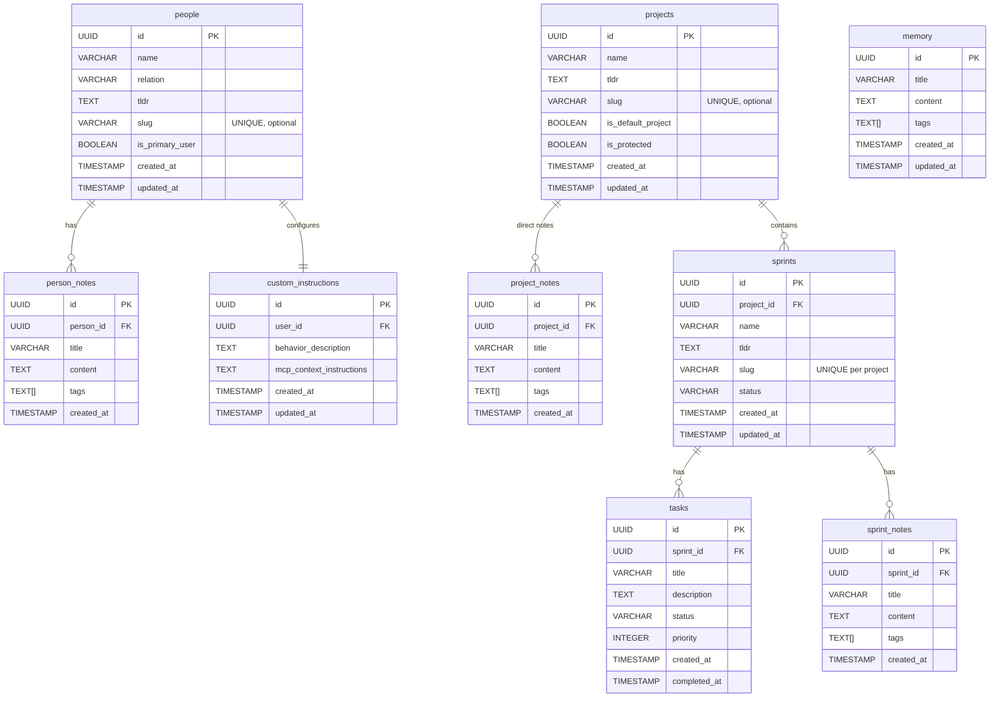

```plantuml
@startuml
!theme plain

skinparam defaultFontName "Inter, Helvetica, Arial, sans-serif"
skinparam shadowing false
skinparam package {
    borderColor #333
    backgroundColor #FFF
}
skinparam rectangle {
    borderColor #666
    backgroundColor #FAFAFA
}
skinparam note {
    backgroundColor #FFFFF0
    borderColor #888
}

title <b>Neural System - Estrutura Lógica</b>

package "OVERVIEW" {
    rectangle "O que dá para fazer" as R_Overview_Actions
    note right of R_Overview_Actions
        - Navegar para seções
        - Ver stats
        - Visualizar config da IA
    end note

    rectangle "Pessoas" as R_Overview_People
    note right of R_Overview_People
        Nome, Relação, Nº Total
    end note

    rectangle "Projetos" as R_Overview_Projects
    note right of R_Overview_Projects
        Nome, Nº Sprints, Nº Tasks Totais
    end note
    
    rectangle "Custom Instructions" as R_Overview_Custom
    note right of R_Overview_Custom
        <b>User Principal:</b> Nome + TL;DR
        <b>Comportamento IA:</b> Instrução de persona
        <b>Context:</b> Instrução de uso do sistema MCP
    end note

    rectangle "Memórias" as R_Overview_Memory
    note right of R_Overview_Memory
        Nome da Memória, Tag, Data
    end note
}

package "PEOPLE" {
    package "Tela: Lista de Pessoas" {
        rectangle "O que aparece" as R_PeopleList_Body
        note right of R_PeopleList_Body
            - Nome, Relação, TL;DR, Nº de notas
            - Marco como user principal (não deletável)
        end note
        
        rectangle "O que dá para fazer" as R_PeopleList_Actions
        note right of R_PeopleList_Actions
            - Criar/Deletar pessoa
            - Clicar para ver detalhes
        end note
    }
    
    R_PeopleList_Body -[hidden]down-> R_PeopleList_Actions
    
    package "Tela: Detalhe da Pessoa" {
        rectangle "O que aparece" as R_PersonDetail_Body
        note right of R_PersonDetail_Body
            - Relação, TL;DR
            - Notas completas da pessoa
        end note
        
        rectangle "O que dá para fazer" as R_PersonDetail_Actions
        note right of R_PersonDetail_Actions
            - Editar infos
            - Deletar pessoa
            - Adicionar/Editar/Deletar notas
        end note
    }
    
    R_PersonDetail_Body -[hidden]down-> R_PersonDetail_Actions
    
    R_PeopleList_Actions ..> R_PersonDetail_Body : "Clica em uma pessoa"
}

package "PROJECTS" {
    package "Tela: Lista de Projetos" {
        rectangle "O que aparece" as R_ProjectList_Body
        note right of R_ProjectList_Body
            - Nome do projeto, TL;DR, nº de sprints/tasks
            - **Nº de project notes diretas**
            - Sprints com nº de tasks
            - "Conhecimento Geral" como projeto protegido
        end note
        
        rectangle "O que dá para fazer" as R_ProjectList_Actions
        note right of R_ProjectList_Actions
            - Criar/Deletar projeto
            - Criar sprint
            - **Criar project notes diretas**
            - Clicar para ver detalhes
        end note
    }
    
    R_ProjectList_Body -[hidden]down- R_ProjectList_Actions

    package "Tela: Detalhe do Projeto" {
        rectangle "O que aparece" as R_ProjectDetail_Body
        note right of R_ProjectDetail_Body
            - Nome/TL;DR do projeto
            - **Seção de Project Notes** (title, content, tags)
            - Lista de sprints (nome, tl;dr, nº tasks/notas)
        end note
        
        rectangle "O que dá para fazer" as R_ProjectDetail_Actions
        note right of R_ProjectDetail_Actions
            - Editar/Deletar projeto
            - **CRUD Project Notes** (create, edit, delete)
            - Criar/Deletar sprint
            - Clicar para ver detalhes de sprint
        end note
    }
    
    R_ProjectDetail_Body -[hidden]down- R_ProjectDetail_Actions
    
    package "Tela: Detalhe do Sprint" {
        rectangle "O que aparece" as R_SprintDetail_Body
        note right of R_SprintDetail_Body
            - Nome/TL;DR do sprint
            - Todas as tasks (título, status, desc)
            - Todas as notas do sprint
        end note
        
        rectangle "O que dá para fazer" as R_SprintDetail_Actions
        note right of R_SprintDetail_Actions
            - Editar sprint
            - CRUD de tasks, CRUD de notas
            - Filtrar tasks por status
        end note
    }
    
    R_SprintDetail_Body -[hidden]down- R_SprintDetail_Actions
    
    R_ProjectList_Actions ..> R_ProjectDetail_Body : "Clica em um projeto"
    R_ProjectDetail_Actions ..> R_SprintDetail_Body : "Clica em um sprint"
}

package "CUSTOM INSTRUCTIONS" {
    package "Tela de Gerenciamento" {
        rectangle "O que aparece" as R_CI_Body
        note right of R_CI_Body
            - <b>User principal:</b> Link para a pessoa
            - <b>Comportamento da IA:</b> Descrição editável
            - <b>Lista de memórias:</b> Título e tags de todas
            - <b>Instruções MCP:</b> Como a IA deve usar o sistema
        end note
        
        rectangle "O que dá para fazer" as R_CI_Actions
        note right of R_CI_Actions
            - Editar comportamento da IA
            - Criar/editar/deletar memórias
            - Organizar memórias por tags
            - Editar instruções de uso do MCP
            - Gerenciar sistema de memória unificado
        end note
    }
    R_CI_Body -[hidden]down- R_CI_Actions
}

@enduml
```

# 🧠 Marco Neural System v2.1 - Arquitetura & Stack Real

## 🎯 **O QUE ESTOU TENTANDO FAZER**

Criei um **Neural System** (sistema de conhecimento pessoal) que funciona com:
- ✅ **Frontend web** (Next.js) para gerenciar dados via interface
- ✅ **Claude.ai via MCP** para IA consultar/modificar dados via API
- ✅ **@vercel/mcp-adapter** unificando protocolos no mesmo repo

**OBJETIVO ATINGIDO**: Claude.ai lê/escreve no Supabase através do mesmo handler que serve o frontend, com protocolos diferentes mas queries idênticas.

**RESULTADO ATUAL**:
```
Marco (Frontend) ────┐
                     ├──► Next.js API (Unified Handler) ──► Supabase
Claude (MCP) ────────┘         @vercel/mcp-adapter
                              
(mesmo database, mesmo código, protocolos diferentes)
```

**Stack Final**: Next.js 15 + @vercel/mcp-adapter + Supabase + Vercel Deploy

## 🏠 **CONTEXTO DO PROJETO**

O **Cognitive Overflow** é um hub experimental modular (Next.js) que abriga múltiplos projetos:
- Marco's Personality Trip, Matrix Project, TokenFlow, Comic Builder
- **Neural System** é UM dos projetos (o mais complexo arquiteturalmente)
- URL: `https://cognitiveoverflow.vercel.app/neural`

## 📁 **STACK & ARQUIVOS PRINCIPAIS**

### Stack Tecnológica
- **Next.js 15** (App Router + Turbopack)
- **@vercel/mcp-adapter** (unifica HTTP REST + MCP JSON-RPC 2.0)
- **Supabase** (PostgreSQL + Row Level Security)
- **Vercel Serverless** (deploy automático)
- **TypeScript** (type safety em tudo)

### Frontend
- `app/neural/page.tsx` - Dashboard principal
- `app/neural/layout.tsx` - Matrix Auth wrapper  
- `components/neural/*` - React tabs (Overview, People, Projects, CustomInstructions)
- `lib/supabase.ts` - Supabase client + queries

### Backend Unificado
- `app/api/[transport]/route.ts` - **Handler único** (HTTP + MCP via adapter)
- `types/index.ts` - Interfaces TypeScript compartilhadas

### Environment
```bash
# .env.local
NEXT_PUBLIC_SUPABASE_URL=https://dtijantzpqtevdqypaeg.supabase.co
NEXT_PUBLIC_SUPABASE_ANON_KEY=eyJhbGciOiJIUzI1NiIsInR5cCI6IkpXVCJ9...
MCP_SECRET_KEY=neural_matrix_jwt_secret_trinity_delineador_2024_hardcore
MCP_MASTER_PASSWORD=neural_access_2024
```

### Desenvolvimento Local
```bash
npm run dev        # Next.js dev server (port 3000/3001)
npm run mcp        # MCP Inspector (testa tools via web)
```

---

## 🎯 **RESUMO DO SISTEMA EM 5 PONTOS**

1. **📊 Overview** que traz estatísticas e navegação: pessoas (count, samples), projetos (count, sprints, tasks), custom instructions (usuário principal + comportamento IA + memória), e links para seções.

2. **👥 Pessoas** com relação, tl;dr e notas pessoais. Marco é usuário principal protegido. Suporte a search por nome/relação.

3. **📁 Projetos** com sprints, tasks e **project notes diretas**. "Conhecimento Geral" é projeto padrão protegido. Navegação: Project → Sprint → Tasks/Notes.

4. **🎭 Custom Instructions** gerencia usuário principal (Marco), comportamento da IA, sistema de memória unificado (title + content + tags), e instruções de uso do MCP.

5. **🔍 Search & Bulk Operations** para busca por tags, nomes, conteúdo, e operações em lote para carregar dados relacionados sem múltiplas queries.

---

## 🗄️ **BANCO DE DADOS & ESTRUTURA v2.1**



### **Key Updates v2.1:**
- ✅ **`project_notes`** table para notas diretas nos projetos (sem necessidade de sprint)
- ✅ **`slug`** fields opcionais para URLs amigáveis e referências por nome
- ✅ **`is_protected`** flag em projects ("Conhecimento Geral" não pode ser deletado)
- ✅ **Índices únicos** em slugs para performance e constraint enforcement
- ✅ **Cascade deletes** configurados (deletar projeto → remove sprints → remove tasks/notes)

**Memory System**: Memórias permanecem unificadas numa tabela. Search por tags, bulk get por IDs, navegação contextual via UI.


---


---

## 📋 **MANIFEST v2.0 - CONTENT INDEX**

O `get_manifest()` retorna metadata completa do sistema para orientar Claude sobre navegação e uso:

```json
{
  "version": "2.1",
  "user": "Marco Fernandes",
  "description": "Personal Neural System - Knowledge & Project Management",
  "database_url": "https://dtijantzpqtevdqypaeg.supabase.co",
  "stats": {
    "people_count": 8,
    "projects_count": 4,
    "sprints_count": 12,
    "tasks_count": 47,
    "memory_count": 23
  },
  "content_index": {
    "people_summary": "Marco (primary user), Yasmin (esposa), José (pai), Rita (mãe), Bruno (irmão)...",
    "projects_summary": "Conhecimento Geral (default), DietFlow (SaaS nutrition), Neural System (MCP)...",
    "recent_activity": "Last updates: DietFlow MVP tasks, Neural System docs, family notes...",
    "memory_tags": ["ai", "saude", "familia", "tech", "projetos", "ideias", "insights"]
  },
  "navigation_hints": {
    "for_people": "Use person names directly: 'get Marco details' → get_person(name:'Marco')",
    "for_projects": "Use project names: 'add note to DietFlow' → create_project_note(project_name:'DietFlow')",
    "for_memory": "Search by tags: 'memories about AI' → search_by_tags(include:['ai'])",
    "bulk_operations": "Load related data: bulk_get([id1,id2], 'projects') for efficiency"
  },
  "protected_entities": {
    "people": ["Marco (primary user)"],
    "projects": ["Conhecimento Geral (default)"]
  }
}
```

### **Content Index Purpose**
- **Orientação inicial**: Claude vê o que existe sem fazer queries desnecessárias
- **Hints de navegação**: Como usar nomes vs IDs, padrões recomendados
- **Proteções**: Entidades que não podem ser deletadas
- **Tags populares**: Para guiar searches eficientes

---

## 🔄 **HANDLER UNIFICADO - Protocolos Diferentes, Lógica Única**

O sistema usa **1 handler** (`app/api/[transport]/route.ts`) que atende tanto Frontend quanto MCP via `@vercel/mcp-adapter`:

### **Frontend Request (HTTP POST)**
```typescript
// Client-side call via fetch
const response = await fetch('/api/http', {
  method: 'POST',
  body: JSON.stringify({
    tool: 'list_people',
    arguments: { relation: 'família', limit: 10 }
  })
});
const data = await response.json();
// Returns: { success: true, data: [...] }
```

### **MCP Request (JSON-RPC 2.0)**
```json
{
  "jsonrpc": "2.0",
  "id": "req-1",
  "method": "tools/call",
  "params": {
    "name": "list_people", 
    "arguments": { "relation": "família", "limit": 10 }
  }
}
```

### **MCP Response (Formatted for AI)**
```json
{
  "jsonrpc": "2.0",
  "id": "req-1", 
  "result": {
    "content": [{
      "type": "text",
      "text": "✅ Found 3 people in família:\n• Yasmin (esposa) - 2 notes\n• José (pai) - 5 notes\n• Rita (mãe) - 3 notes"
    }]
  }
}
```

### **Unified Logic Flow**
```typescript
// Same handler function for both protocols
async function handleListPeople(args: { relation?, limit? }) {
  // Same Supabase query for both
  const { data, error } = await supabase
    .from('people')
    .select('*, person_notes(count)')
    .eq('relation', args.relation)
    .limit(args.limit || 50);

  // Protocol-specific response formatting
  if (isMCPRequest) {
    return formatForAI(data); // "✅ Found X people..."
  } else {
    return { success: true, data }; // Raw JSON for UI
  }
}
```

**Key Insight**: 
- **Mesma lógica**, formatos diferentes
- **MCP** = texto formatado para IA consumption
- **Frontend** = JSON bruto para UI manipulation
- **Database queries** = 100% idênticas

---

## 🛠️ **FERRAMENTAS DISPONÍVEIS (30 TOTAL)**

### 👥 People Management (6 tools)
- `list_people(relation?, search?, limit?)` - Lista pessoas com filtros
- `get_person(id?, name?)` - Detalhes + notes count *(fallback: name→id)*
- `create_person(name, relation, tldr?)` - Criar pessoa
- `update_person(id?, name?, relation?, tldr?)` - Atualizar pessoa *(id ou name)*
- `delete_person(id?, name?)` - Deletar pessoa *(exceto Marco)*
- `create_person_note(person_id?, person_name?, title, content, tags?)` - Nota em pessoa

### 📁 Project Management (9 tools)
- `list_projects(limit?)` - Lista projetos + sprints count + notes count
- `get_project(id?, name?)` - Projeto + sprints + project_notes *(fallback: name→id)*
- `create_project(name, tldr?)` - Criar projeto novo
- `update_project(id?, name?, tldr?)` - Atualizar projeto *(id ou name)*
- `delete_project(id?, name?)` - Deletar projeto *(exceto "Conhecimento Geral")*
- `create_project_note(project_id?, project_name?, title, content, tags?)` - Nota direta no projeto
- `update_project_note(note_id, title?, content?, tags?)` - Editar nota do projeto
- `delete_project_note(note_id)` - Deletar nota do projeto
- `create_knowledge_note(title, content, tags?)` - Shortcut para "Conhecimento Geral"

### 🏃 Sprint Management (4 tools)
- `create_sprint(project_id?, project_name?, name, tldr?, status?)` - Criar sprint
- `get_sprint(id?, name?, project_name?)` - Sprint + tasks + notes *(fallback)*
- `update_sprint(id?, name?, tldr?, status?)` - Atualizar sprint
- `delete_sprint(id?, name?)` - Deletar sprint + cascade tasks/notes

### ✅ Task Management (4 tools)
- `create_task(sprint_id?, sprint_name?, title, description?, priority?)` - Criar task
- `get_task(id?, title?)` - Detalhes da task *(fallback: title→id)*
- `update_task(id?, title?, description?, status?, priority?)` - Atualizar task
- `delete_task(id?, title?)` - Deletar task

### 📝 Notes Management (6 tools)
- `create_sprint_note(sprint_id?, sprint_name?, title, content, tags?)` - Nota em sprint
- `update_sprint_note(note_id, title?, content?, tags?)` - Editar nota de sprint
- `delete_sprint_note(note_id)` - Deletar nota de sprint
- `update_note(note_id, title?, content?, tags?)` - Editar qualquer nota *(universal)*
- `delete_note(note_id)` - Deletar qualquer nota *(universal)*
- `get_note(note_id)` - Get nota específica *(person/project/sprint)*

### 🧠 Memory Management (3 tools)
- `list_memory(limit?)` - Lista título + tags de todas as memórias
- `get_memory(id?, title?)` - Conteúdo completo de memória *(fallback)*
- `search_by_tags(include?, exclude?, mode?)` - Search por tags (meta/full)

### 🔍 Search & Bulk (2 tools)
- `bulk_get(ids, type)` - Carrega múltiplos objetos de uma vez *(people/projects/sprints/tasks/memory)*
- `get_manifest()` - Metadata completa do sistema + content_index

### ⚙️ Custom Instructions (1 tool)
- `get_custom_instructions()` - Config da IA + usuário principal + instruções MCP

---

### **Padrões de Nome vs ID (Fallback Inteligente)**
```typescript
// Preferência: usar nomes (mais legível)
create_sprint({ project_name: "DietFlow", name: "MVP Launch", tldr: "..." })

// Fallback: se nome ambíguo ou não encontrado, usar ID
get_project({ id: "uuid-123-456" })

// Erro típico: 404 não encontrado, 409 nome duplicado
```

### **Convenções de Resposta**
- ✅ **Sucesso**: `"✅ [Action] completed: [details]"`
- ❌ **Erro**: `"❌ [Error type]: [details]"`  
- ⚠️ **Warning**: `"⚠️ [Action] completed with warnings: [details]"`
- 📄 **JSON**: `{ type:"json", data:{...} }` para payloads > 1k chars

---

## 💡 **EXEMPLOS DE USO - Name-First Approach**

### **Fluxo Típico de Conversa com Claude**

```
🤖 Claude: "Preciso criar uma nota sobre Machine Learning no projeto DietFlow"

👤 Marco: create_project_note({
  project_name: "DietFlow",
  title: "ML para Recomendações",
  content: "Usar TensorFlow para sugestões personalizadas...",
  tags: ["ml", "tech", "mvp"]
})

✅ Response: "Project note created in DietFlow: ML para Recomendações"
```

### **Search & Bulk Operations**

```javascript
// 1. Search por tags para encontrar memórias relevantes
search_by_tags({ include: ["ai", "tech"], mode: "meta" })
// Returns: list of memory IDs with matching tags

// 2. Bulk get para carregar conteúdo completo
bulk_get({ ids: ["mem1", "mem2", "mem3"], type: "memory" })
// Returns: full content of all 3 memories in one call
```

### **Error Handling Examples**

```
❌ get_person({ name: "João" })
→ "❌ Person not found: João. Did you mean: José (pai)?"

❌ create_project({ name: "DietFlow" })
→ "❌ Project already exists: DietFlow (409 conflict)"

⚠️ delete_project({ name: "Conhecimento Geral" })
→ "⚠️ Cannot delete protected project: Conhecimento Geral"
```

### **Smart Fallbacks in Action**

```typescript
// Scenario: Ambiguous name
get_sprint({ name: "MVP", project_name: "DietFlow" })
// Context helps disambiguate

// Scenario: Name not found, fallback to ID
get_project({ name: "NonExistent" })
// Returns 404, then use: get_project({ id: "uuid-123" })
```

---

## 🏗️ **ROADMAP & IMPLEMENTAÇÕES v2.1**

### ✅ **Implemented (Current)**
- [x] Handler unificado (Frontend + MCP no mesmo repo)
- [x] 30 MCP tools com fallback name→id
- [x] Project notes diretas (sem necessidade de sprint)
- [x] Proteção de entidades ("Marco", "Conhecimento Geral")
- [x] Manifest v2.0 com content_index
- [x] Search by tags + bulk operations
- [x] Cascade deletes (project→sprints→tasks/notes)
- [x] Error handling padronizado (✅❌⚠️)

### 🔄 **In Progress**
- [ ] Slug-based URLs (`/neural/projects/dietflow`)
- [ ] Real-time sync entre Frontend e MCP calls
- [ ] Advanced search (full-text, date ranges)

### 🗺️ **Backlog**
- [ ] Export/Import sistema completo (JSON/Markdown)
- [ ] Webhook integrations (GitHub, Notion)
- [ ] Multi-user support (team neural systems)
- [ ] AI-powered auto-tagging
- [ ] Graph visualization de relacionamentos

---

## 🎯 **GETTING STARTED - Quick Commands**

```bash
# 1. Ver overview do sistema
get_manifest()

# 2. Listar projetos ativos
list_projects({ limit: 10 })

# 3. Adicionar nota rápida no Knowledge
create_knowledge_note({
  title: "Insight sobre Neural Systems",
  content: "MCP + Vercel = poder sem limites",
  tags: ["insight", "tech"]
})

# 4. Buscar memórias técnicas
search_by_tags({ include: ["tech"], mode: "full" })

# 5. Ver detalhes de pessoa específica
get_person({ name: "Marco" })
```

**Happy Neural System Navigation! 🧠⚡**

---
