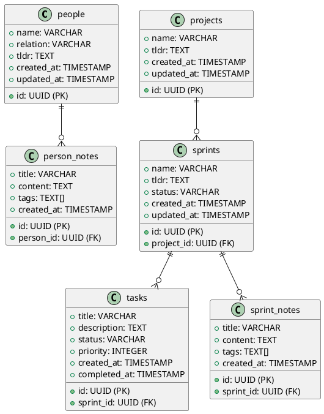
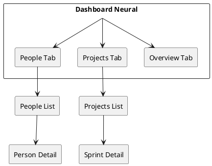

# 🕵️ NEURAL SYSTEM FORENSIC AUDIT

## 🎯 MISSÃO: Investigação Completa + Documentação PlantUML

**OBJETIVO:** Mapear a **REAL SITUAÇÃO** do sistema Neural para limpar a bagunça e implementar MCP correto.

---

## 📋 CHECKLIST DE INVESTIGAÇÃO

### 1. **🗄️ SUPABASE DATABASE AUDIT**
```sql
-- Descobrir que tabelas REALMENTE existem
SELECT table_name, table_type 
FROM information_schema.tables 
WHERE table_schema = 'public'
ORDER BY table_name;

-- Ver estrutura de cada tabela
\d+ people
\d+ person_notes  
\d+ projects
\d+ sprints
\d+ tasks
\d+ sprint_notes
\d+ users

-- Contar registros reais
SELECT 'people' as table, count(*) from people
UNION SELECT 'person_notes', count(*) from person_notes
UNION SELECT 'projects', count(*) from projects
UNION SELECT 'sprints', count(*) from sprints
UNION SELECT 'tasks', count(*) from tasks
UNION SELECT 'sprint_notes', count(*) from sprint_notes;
```

**DESCOBRIR:**
- ✅ Que tabelas existem de verdade?
- ✅ Que campos cada tabela tem?
- ✅ Que dados de exemplo estão lá?
- ✅ Que constraints/indexes existem?

### 2. **⚛️ NEXT.JS FRONTEND AUDIT**

**Arquivos para investigar:**
```bash
# Interface atual
components/neural/OverviewTab.tsx
components/neural/PeopleTab.tsx
components/neural/ProjectsTab.tsx

# Tipos e configuração
lib/supabase.ts
types/
config/

# Páginas e layouts
app/neural/page.tsx
app/neural/layout.tsx
```

**DESCOBRIR:**
- ✅ Que componentes funcionam?
- ✅ Que operações CRUD existem?
- ✅ Como o frontend se conecta ao Supabase?
- ✅ Que navegação existe (Overview → People → Projects)?

### 3. **🔌 API ENDPOINTS AUDIT**

**Arquivos para investigar:**
```bash
# Endpoints MCP atuais
app/api/mcp/manifest/route.ts
app/api/mcp/people/route.ts
app/api/mcp/people/[id]/route.ts
app/api/mcp/people/search/route.ts
app/api/mcp/people/analytics/route.ts
app/api/mcp/projects/route.ts
app/api/mcp/projects/active/route.ts
app/api/mcp/projects/search/route.ts
app/api/mcp/projects/analytics/route.ts
app/api/mcp/projects/tasks/route.ts

# Auth e tipos
lib/mcp-auth.ts
lib/mcp-types.ts
lib/mcp-security.ts
```

**DESCOBRIR:**
- ✅ Quantos endpoints existem?
- ✅ Quais funcionam de verdade?
- ✅ Que operações são suportadas (GET/POST/PUT/DELETE)?
- ✅ Que bagunça de complexidade desnecessária existe?

---

## 📊 PLANTXML DOCUMENTATION TARGET

Vamos criar diagramas para visualizar:

### **Database Schema (PlantUML)**


### **Frontend Navigation Flow (PlantUML)**


### **API Endpoints Architecture (PlantUML)**
```plantuml
@startuml Neural_API_Architecture
!define API cloud

API "Claude.ai" as claude
API "Neural MCP" as mcp
API "Supabase" as supabase

claude --> mcp : MCP Protocol
mcp --> supabase : SQL Queries

package "MCP Endpoints" {
  [/api/mcp/manifest] as manifest
  [/api/mcp/people] as people_api
  [/api/mcp/people/[id]] as person_api
  [/api/mcp/projects] as projects_api
  [/api/mcp/sprints/[id]] as sprint_api
}

mcp --> manifest
mcp --> people_api
mcp --> person_api
mcp --> projects_api
mcp --> sprint_api

@enduml
```

---

## 🔥 INVESTIGATION PROMPTS

### **PROMPT 1: Database Reality Check**
```
🕵️ INVESTIGAÇÃO FORENSE: SUPABASE DATABASE

Analyze the actual Supabase database structure by:

1. **Table Discovery**: List all tables in the public schema
2. **Schema Analysis**: Describe each table structure (columns, types, constraints)
3. **Data Audit**: Count actual records in each table
4. **Relationship Mapping**: Document foreign key relationships
5. **Sample Data**: Show 2-3 example records from each table

**CRITICAL**: Only document what ACTUALLY EXISTS, not what should exist.

Create a PlantUML entity relationship diagram showing the REAL database structure.

Include:
- All actual tables and columns
- Data types and constraints  
- Primary/foreign key relationships
- Sample data counts

**FORMAT**: 
- PlantUML ERD diagram
- Table-by-table documentation
- Data volume summary
```

### **PROMPT 2: Frontend Capabilities Audit**
```
🕵️ INVESTIGAÇÃO FORENSE: NEXT.JS FRONTEND

Analyze the Neural System frontend by examining:

1. **Component Analysis**: What React components exist and work?
2. **CRUD Operations**: What create/read/update/delete operations are implemented?
3. **Navigation Flow**: How does user navigate between sections?
4. **Supabase Integration**: How does frontend connect to database?
5. **State Management**: What local state vs server state exists?

**CRITICAL**: Test actual functionality, not just code existence.

Create a PlantUML component diagram showing:
- User interface flow
- Component hierarchy  
- Data flow from UI to Supabase
- Actual working vs broken features

**FORMAT**:
- PlantUML component diagram
- Feature inventory (working/broken)
- Navigation map
- Integration points
```

### **PROMPT 3: API Endpoints Reality Check**
```
🕵️ INVESTIGAÇÃO FORENSE: MCP API ENDPOINTS

Analyze the MCP API implementation by:

1. **Endpoint Inventory**: List all /api/mcp/* endpoints that exist
2. **Method Support**: What HTTP methods each endpoint supports
3. **Functionality Test**: What operations actually work vs fail
4. **Response Analysis**: What data each endpoint returns
5. **Complexity Audit**: What unnecessary complexity exists?

**CRITICAL**: Test actual API responses, don't assume from code.

Create a PlantUML sequence diagram showing:
- Claude → MCP API interaction flow
- Database query patterns
- Response data structure
- Authentication flow

**FORMAT**:
- PlantUML sequence diagram  
- Endpoint capability matrix
- API simplification recommendations
- CRUD gap analysis
```

---

## 📈 DELIVERABLE TARGET

### **DOCUMENTATION PACKAGE:**

1. **📊 Database Schema Diagram** (PlantUML)
2. **🎨 Frontend Architecture Diagram** (PlantUML)  
3. **🔌 API Sequence Diagram** (PlantUML)
4. **📋 Gap Analysis Report** (Markdown)
5. **🎯 Simplification Roadmap** (Markdown)

### **CLEAN ENDPOINT DESIGN:**

Based on frontend navigation:
```
/api/mcp/manifest          → System overview
/api/mcp/people            → People dashboard  
/api/mcp/people/[id]       → Person detail
/api/mcp/projects          → Projects dashboard
/api/mcp/sprints/[id]      → Sprint detail
```

### **CRUD OPERATIONS NEEDED:**
```typescript
// People
POST   /api/mcp/people           → Create person
PUT    /api/mcp/people/[id]      → Update person  
POST   /api/mcp/people/[id]/notes → Add note

// Projects
POST   /api/mcp/projects         → Create project
POST   /api/mcp/projects/[id]/sprints → Create sprint

// Tasks  
POST   /api/mcp/sprints/[id]/tasks → Create task
PUT    /api/mcp/tasks/[id]       → Update task status
```

---

## 🎯 EXECUTION PLAN

1. **INVESTIGATE** → Run all 3 audit prompts
2. **DOCUMENT** → Create PlantUML diagrams  
3. **SIMPLIFY** → Clean up endpoints
4. **IMPLEMENT** → Add missing CRUD operations
5. **TEST** → Validate Claude integration

**READY TO INVESTIGATE?** 🔥🕵️‍♂️💀