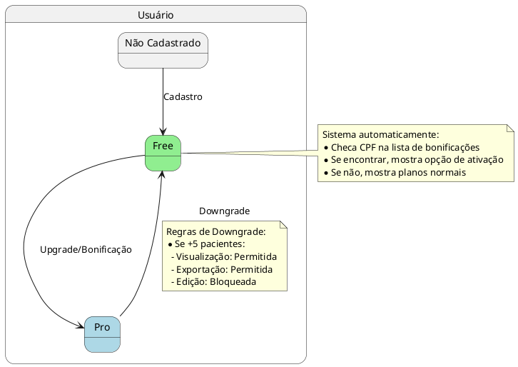
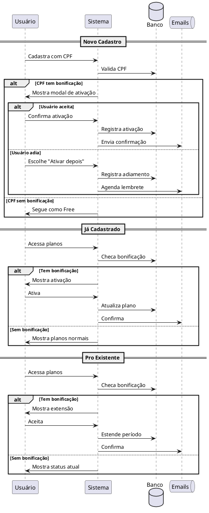
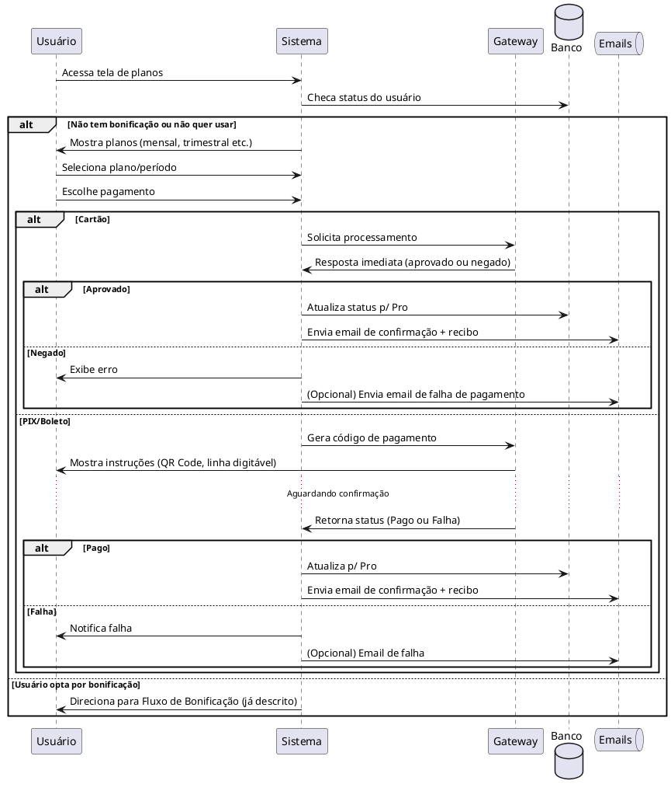
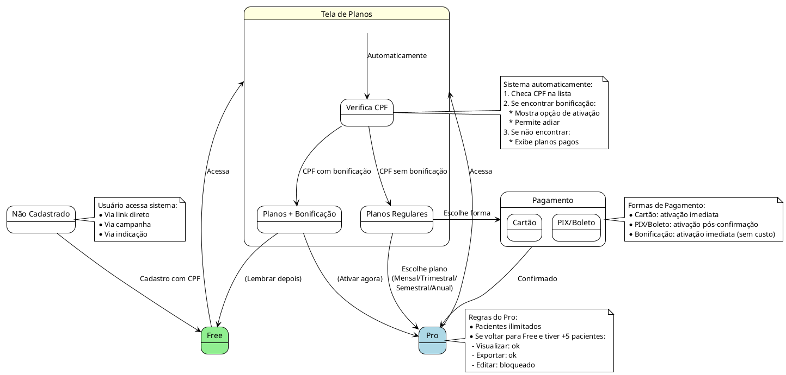

# Sistema de Pagamento e Bonificação

Este documento descreve como funciona o sistema de pagamentos e bonificações, contemplando:

- **Visão Geral** (estados Free/Pro e fluxo básico)
- **Fluxo de Bonificação** (como o sistema checa o CPF e oferece o período gratuito)
- **Fluxo de Pagamento Regular** (planos pagos via cartão, PIX ou boleto)
- **Fluxo Completo** (unindo bonificação e pagamento)
- **Explicação** de cada ponto-chave e regras de negócio

---

## 1. Visão Geral do Sistema

No diagrama abaixo, temos os estados do **Usuário** (subdividido em "Não Cadastrado", "Free" e "Pro") e as possíveis transições (cadastro, upgrade/bonificação e downgrade):

### Resumo
1. **Não Cadastrado → Free**: Quando o usuário realiza o primeiro cadastro (obrigatoriamente com CPF).
2. **Free → Pro**: O usuário pode migrar para Pro seja por:
   - Bonificação (se o CPF estiver em uma lista especial).
   - Pagamento (escolhendo um plano e confirmando).
3. **Pro → Free**: Ocorre por expiração (não renovado), cancelamento ou downgrade manual. Se tiver mais de 5 pacientes, edição fica bloqueada até remover pacientes ou retomar Pro.

## 2. Fluxo de Bonificação

Este diagrama de sequência ilustra como o sistema verifica o CPF e oferece bonificação, seja durante o cadastro ou para quem já está logado. Também cobre o caso de quem já é Pro:

### Pontos de Destaque
1. **Verificação de CPF**:
   - Ao cadastrar ou ao acessar a tela de planos, o sistema checa no banco de dados se o CPF tem bonificação disponível.
2. **Modal de Ativação**:
   - Caso o CPF seja elegível, o sistema oferece um modal ou aviso com o período gratuito (ex.: 30, 60 ou 90 dias).
3. **Aceitação ou Adiamento**:
   - O usuário pode ativar na hora (virando Pro ou estendendo Pro existente)
   - Ou escolher "Ativar Depois" (mantendo-se Free ou continuando Pro do jeito que está).
   - Se ele adiar, o sistema pode enviar lembretes e tem de controlar a data de expiração da bonificação.
4. **Para Usuários já Pro**:
   - A bonificação estende a data de expiração. Se faltavam 10 dias e a bonificação é de 30, passa a vencer em 40 dias.
5. **Emails**:
   - Confirmação de ativação ou extensão.
   - Lembrete (caso adie) ou aviso de expiração se não ativar em X dias.

## 3. Fluxo de Pagamento Regular

Aqui ilustramos o pagamento de um plano Pro (sem bonificação). O usuário escolhe o período (mensal, trimestral, etc.) e a forma de pagamento (cartão, PIX ou boleto):

### Resumo do Pagamento
1. **Cartão**:
   - Confirmação quase imediata (gateway devolve aprovado/negado).
   - Se aprovado, usuário passa a Pro na hora; se negado, permanece Free.
2. **PIX/Boleto**:
   - O sistema gera um código ou boleto.
   - O usuário paga e a confirmação chega via webhook ou consulta programada.
   - Ao confirmar pagamento, o plano Pro é ativado e o usuário recebe email.
   - Se falhar (prazo expirado ou pagamento cancelado), não ativa o Pro.
3. **Emails**:
   - Confirmação e recibo após pagamento aprovado.
   - Lembretes de boleto, se configurado, e aviso de falha no pagamento (opcional).

## 4. Fluxo Completo do Sistema

Abaixo, um diagrama de estados mostrando, de forma mais macro, como o usuário entra (cadastro), checa se tem bonificação ou não, e conclui pagamento ou upgrade. Incluímos a ideia de "Tela de Planos", que apresenta Planos Regulares ou Planos + Bonificação:

## 5. Explicação do Fluxo e Lógica de Negócio

1. **Entrada no Sistema**
   - O usuário acessa o sistema (como novo ou existente).
   - Se for novo, faz o cadastro com CPF – obrigatório para futuros checks de bonificação.

2. **Verificação Automática**
   - Ao entrar na Tela de Planos, o sistema confere se o CPF está numa lista de bonificações (importada por parceiros ou marketing).
   - Se encontrar, oferece ativar o período gratuito (ou estender, caso o usuário já seja Pro).
   - Se não encontrar, mostra apenas os planos pagos.

3. **Ativação da Bonificação**
   - Usuário pode aceitar de imediato e virar Pro (ou ter Pro estendido).
   - Pode também adiar, continuando no Free (ou no Pro atual se já tinha). O sistema pode enviar lembretes e há data de expiração da bonificação.

4. **Pagamento (Cartão / PIX / Boleto)**
   - Se o usuário não tiver ou não quiser a bonificação, escolhe um plano (mensal, trimestral, semestral, anual etc.) e a forma de pagamento.
   - Cartão: aprovação quase instantânea. Se aprovado, vira Pro na hora.
   - PIX/Boleto: gera QR code ou boleto. O sistema aguarda confirmação do pagamento. Somente então o usuário é liberado no Pro.
   - Em qualquer forma de pagamento, o sistema envia emails (confirmação, recibo, falha etc.).

5. **Downgrade e Expiração**
   - Se o usuário não renova ou cancela, volta a Free.
   - Caso possua mais de 5 pacientes, fica com visualização/exportação habilitadas, mas edição bloqueada até reduzir pacientes ou reativar Pro.
   - Emails de aviso podem ser enviados antes da expiração (7 dias/1 dia) e após o downgrade.

6. **Principais Vantagens**
   - Automação: Bonificação é detectada só pelo CPF (não precisa inserir código).
   - Experiência Simplificada: O usuário vê claramente as opções (gratuito ou pago) sem confusão.
   - Transparência: Quem não tem bonificação não fica vendo anúncios de "grátis"; quem tem, vê a oferta no momento certo.
   - Notificações: Sistema dispara emails de lembrete de ativação, confirmação de pagamento, nota fiscal, aviso de expiração, etc., garantindo envolvimento e reduzindo dúvidas.

## Conclusão

Esta arquitetura permite que Marketing e Parcerias simplesmente mantenham listas de CPFs ou importem dados dos participantes de cursos/eventos. O Usuário só precisa se cadastrar ou logar, e o Sistema cuida de oferecer a bonificação. Caso o usuário não tenha direito ou não queira usar a bonificação, pode optar por um plano pago, com pagamento online seguro e notificado por email.

Assim, temos um fluxo claro de cadastro → checagem de bonificação → bonificação ou pagamento → ativação Pro (ou extensão). Quando o plano expira ou o usuário não renova, downgrade acontece sem perda de dados, apenas restrições de edição se tiver mais de 5 pacientes.

Com estes quatro diagramas (Visão Geral, Fluxo de Bonificação, Fluxo de Pagamento Regular e Fluxo Completo) e a explicação didática, toda a equipe entende tanto a perspectiva do usuário quanto a lógica interna do sistema de pagamento e bonificação. 